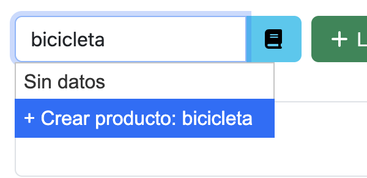
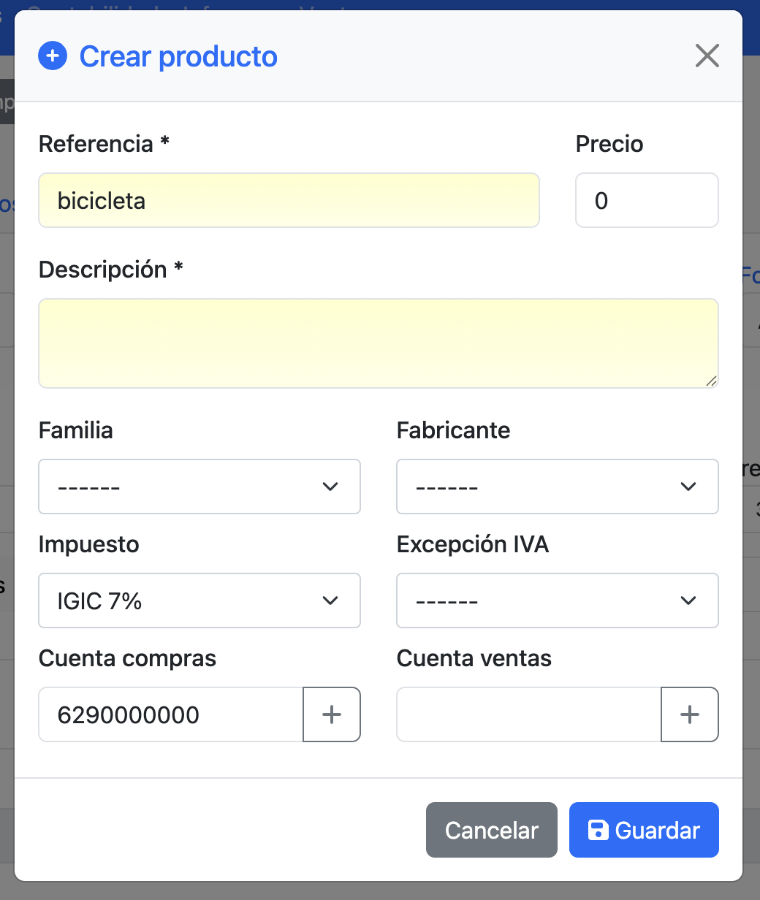
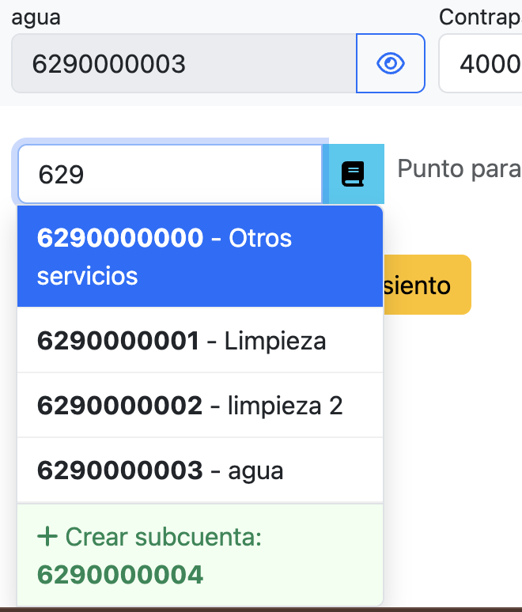
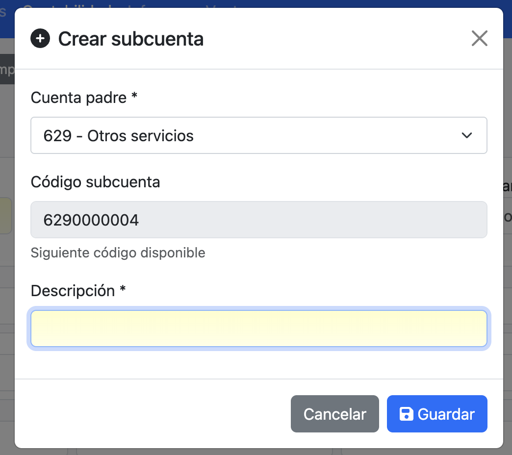

# QuickCreate para FacturaScripts

Plugin que permite crear productos y subcuentas contables de forma rápida sin salir del documento que estás editando.

## Creación rápida de productos

Cuando escribes en el campo de producto en presupuestos, pedidos, albaranes o facturas y no existe, aparece la opción de crearlo directamente desde el desplegable.

  

Al seleccionar la opción se abre un modal donde puedes completar los datos del nuevo producto: referencia, precio, descripción, familia, fabricante, impuesto y cuentas contables.

  

## Creación rápida de subcuentas

En los asientos contables y en los campos de cuenta de productos, cuando buscas una subcuenta que no existe, puedes crearla directamente.

  

El plugin calcula automáticamente el siguiente código disponible dentro de la cuenta padre seleccionada.

  

## Características

- **Creación sin interrupciones**: No necesitas abandonar el documento para crear nuevos productos o subcuentas
- **Código automático**: Las subcuentas se crean con el siguiente código disponible
- **Integración total**: Funciona en todos los documentos de compra y venta, y en asientos contables

## Instalación

1. Descarga el ZIP desde [Releases](../../releases/latest)
2. Ve a **Panel de Admin > Plugins** en FacturaScripts
3. Sube el archivo ZIP y activa el plugin

## Licencia

LGPL-3.0. Ver [LICENSE](LICENSE) para más detalles.
